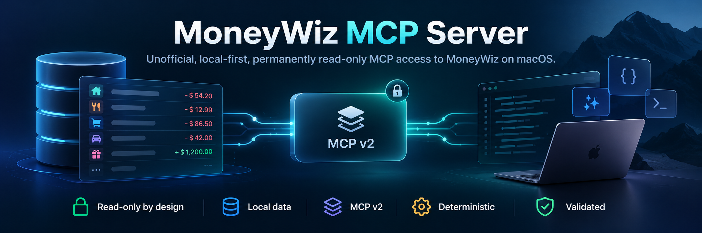

<p align="center">
  
</p>

# MoneyWiz MCP Server

**Unofficial, local-first, permanently read-only MCP v2 access to MoneyWiz on macOS.**

MoneyWiz MCP Server lets MCP-compatible clients query a local MoneyWiz database through a deterministic, read-only interface. It is designed for factual retrieval and reproducible aggregation, not financial advice.

[](https://www.python.org/)
[](https://modelcontextprotocol.io/)
[](LICENSE)
[](https://www.apple.com/macos/)
[](#security-model)

## Why this project exists

The original `jcvalerio/moneywiz-mcp-server` proved that useful MoneyWiz access through MCP was possible. This maintained 2.x line hardens that idea for real financial data by removing fixed Core Data entity assumptions, making read-only behavior structural rather than optional, modernizing to MCP v2, and tightening money, date, completeness, privacy, and error semantics.

The implementation includes synthetic regression tests and a local validation CLI. Validate supported results against MoneyWiz-produced exports for your own store; unsupported or unrecognized schema conditions fail explicitly instead of silently returning partial data.

## Key features

- Permanent SQLite read-only access using `mode=ro`, `query_only=ON`, `trusted_schema=OFF`, and a deny-by-default authorizer.
- Dynamic Core Data entity discovery from `Z_PRIMARYKEY`; no production dependence on fixed numeric `Z_ENT` IDs.
- MCP Python SDK v2 with local stdio transport.
- Accounts, transactions, categories, payees, tags, budgets, scheduled transactions, and deterministic cashflow summaries.
- Decimal-safe financial arithmetic and explicit currencies.
- No implicit FX conversion or cross-currency totals.
- Stable pagination and explicit truncation/completeness metadata.
- Explicit schema and integrity errors instead of silent fallbacks.
- Local reconciliation CLI for validating a real MoneyWiz store.
- No telemetry exporter and no server-side network transport.

## Architecture

<p align="center">
  
</p>

The data path is intentionally simple:

```text
MCP client
   ↓ stdio
MoneyWiz MCP Server
   ↓
services
   ↓
Schema resolver
   ↓
read-only SQLite
   ↓
MoneyWiz Core Data database
```

See [`ARCHITECTURE.md`](ARCHITECTURE.md) and [`docs/ENGINEERING_AUDIT.md`](docs/ENGINEERING_AUDIT.md) for implementation detail.

## Requirements

- macOS with MoneyWiz installed or a compatible MoneyWiz SQLite database/backup.
- Python 3.10 or later.
- `uv` recommended for deterministic installation.
- An MCP-compatible client such as Codex, Claude Desktop, or another stdio MCP client.

## Install

Clone this repository and install the locked environment:

```sh
git clone https://github.com/claessee/moneywiz-mcp-server.git
cd moneywiz-mcp-server
uv sync --frozen --all-extras
```

The server entry point is:

```sh
.venv/bin/python -m moneywiz_mcp_server
```

## Configure the MoneyWiz database

For real use, set an explicit absolute path in `MONEYWIZ_DB_PATH`.

A common current macOS/iCloud location is:

```text
$HOME/Library/Containers/com.moneywiz.personalfinance/Data/Library/Application Support/MoneyWiz_iCloud.sqlite
```

Use the primary SQLite file only. Do not select `_shared.sqlite`, `-wal`, `-shm`, or `-journal` files as the database path.

Optional discovery is available with `MONEYWIZ_AUTO_DISCOVER=true`, but explicit configuration is preferred. Discovery validates candidates and fails on ambiguity rather than choosing a database heuristically.

## Codex configuration

Use an absolute Python path and an absolute database path:

```toml
[mcp_servers.moneywiz]
command = "/absolute/path/to/moneywiz-mcp-server/.venv/bin/python"
args = ["-m", "moneywiz_mcp_server"]

[mcp_servers.moneywiz.env]
MONEYWIZ_DB_PATH = "/absolute/path/to/MoneyWiz_iCloud.sqlite"
MAX_RESULTS = "500"
```

Equivalent stdio configurations can be used with other MCP clients. Examples are in [`examples/`](examples/).

## Available tools

| Tool | Purpose |
| --- | --- |
| `server_status` | Verify database, SQLite, and schema readiness |
| `schema_info` | Inspect discovered MoneyWiz entities and capabilities |
| `list_accounts` | List accounts and diagnostic balance components |
| `get_account` | Retrieve one account by returned ID or exact identifier |
| `search_transactions` | Search transactions by interval, account, category, and type |
| `list_categories` | List categories with complete parent hierarchy |
| `list_tags` | List stored tags |
| `list_payees` | List stored payees |
| `list_budgets` | List factual stored budget fields |
| `list_scheduled_transactions` | List stored scheduled transaction definitions |
| `summarize_cashflow` | Deterministic per-currency cashflow and category summary |

All list-style tools expose bounded pagination and completeness metadata. See the source tool schemas for the authoritative parameter contract.

## Money and currency semantics

Every returned monetary value carries an explicit currency and uses a decimal string representation. The server does not combine nominal amounts across currencies and does not perform implicit FX conversion.

Cashflow summaries treat deposits as income and withdrawals as expenses within each currency. Transfers, reconciliations, refunds, and investment transactions remain distinct stored transaction types rather than being silently reclassified.

## Balance semantics

Checking, savings, cash, and credit-card balance components are exposed for reconciliation. The calculated balance is opening balance plus stored transaction amounts; the credit limit is returned separately. Compare these components with MoneyWiz for your own store.

Investment, forex, and loan valuation remain intentionally non-authoritative where MoneyWiz semantics have not been proven. The server prefers an explicit unsupported result over a plausible-looking but unverified number.

## Dates and completeness

Intervals use **[start, end)** semantics. Date-only inputs resolve at midnight in the requested IANA timezone, defaulting to `UTC`. Datetimes require an explicit offset or `Z`.

Potentially large result sets are bounded and return `matched_count`, `returned_count`, `limit`, `offset`, `truncated`, and `next_offset` where applicable. Aggregates are not silently calculated from a truncated transaction page.

## Validation

Run the reconciliation CLI against your own store before relying on the MCP:

```sh
.venv/bin/python -m moneywiz_mcp_server.validate \
  --db "$HOME/Library/Containers/com.moneywiz.personalfinance/Data/Library/Application Support/MoneyWiz_iCloud.sqlite" \
  --start 2025-01-01 --end 2025-02-01
```

Compare transaction counts, transaction types, transfers, per-currency cashflow, categories, split transactions, and supported account balances with MoneyWiz-produced exports. Keep financial data and validation results private.

See [`docs/RECONCILIATION.md`](docs/RECONCILIATION.md) and [`docs/IMPLEMENTATION_REPORT.md`](docs/IMPLEMENTATION_REPORT.md).

## Security model

The server cannot enable writable mode. SQLite is opened with URI `mode=ro`, `PRAGMA query_only=ON`, `trusted_schema=OFF`, and a restrictive SQLite authorizer. There is no raw-SQL MCP tool or commit/write helper.

The server itself performs no financial-data network calls. Requested MCP results are sent over stdio to the connected client; that client may then send selected tool results to its model provider according to the client's own privacy policy and settings.

SQLite may use normal locking/shared-memory metadata while reading a live WAL-backed store. The guarantee is that this server does not modify MoneyWiz financial rows, schema, or WAL records.

See [`SECURITY.md`](SECURITY.md).

## Development

```sh
uv run --frozen pytest
uv run --frozen python scripts/check_critical_coverage.py
uv run --frozen ruff check .
uv run --frozen ruff format --check .
uv run --frozen mypy src/
uv run --frozen bandit -r src/
uv run --frozen pip-audit --local --skip-editable
uv build --no-sources
uv run --frozen twine check dist/*
```

Tests use fabricated financial data only. Contributions must preserve permanent read-only behavior, explicit currencies, deterministic schema handling, and regression coverage for any new MoneyWiz schema assumptions. See [`CONTRIBUTING.md`](CONTRIBUTING.md).

## Origins and attribution

This project is based on [`jcvalerio/moneywiz-mcp-server`](https://github.com/jcvalerio/moneywiz-mcp-server), created by Juan Carlos Valerio Arrieta and contributors. The complete Git history is retained and the project remains MIT licensed. See [`ATTRIBUTION.md`](ATTRIBUTION.md).

## License

MIT. See [`LICENSE`](LICENSE).

## Unofficial project

MoneyWiz™ is a registered trademark and property of SILVERWIZ LLC. This project is independent, unofficial, and is not affiliated with, sponsored by, or endorsed by SILVERWIZ LLC. No MoneyWiz or SILVERWIZ logos or proprietary artwork are included.
